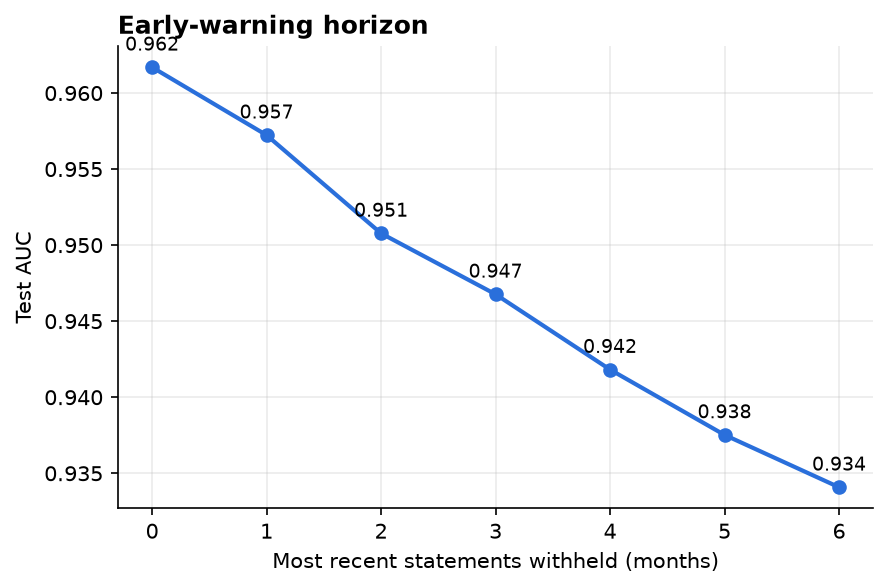
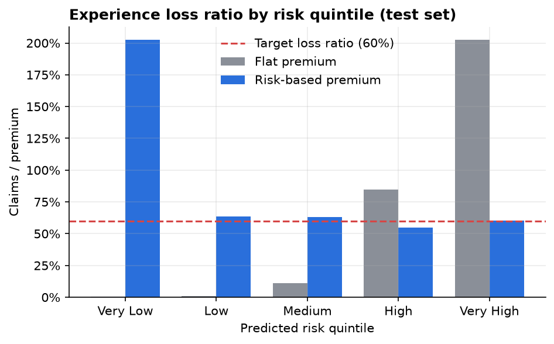
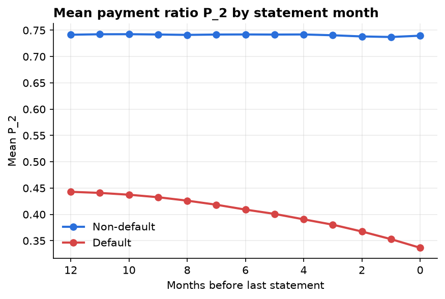
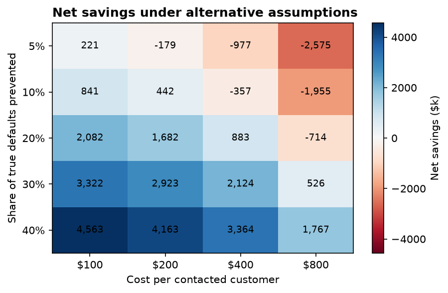

# Credit Card Default Prediction for Payment Protection Insurance


Can 13 months of credit-card statements tell an insurer **who will default, and how early**, well
enough to price **Payment Protection Insurance (PPI)** by risk and to contact at-risk customers
before they default?

This repo answers that on the real [American Express Default Prediction](https://www.kaggle.com/competitions/amex-default-prediction)
data with a reproducible pipeline: behavioral feature engineering → model comparison → early-warning
horizon test → probability calibration → risk-based pricing → intervention cost-benefit → SHAP.

## Results (50,000-customer random sample, held-out test set of 10,000)

| | |
|---|---|
| **Best model** | LightGBM, selected on validation |
| **Test AUC / Gini** | **0.957** / 0.915 |
| **AMEX competition metric (M)** | 0.779 |
| **Early warning** | AUC still **0.934 with the last 6 months of statements withheld** |
| **Trajectory vs. snapshot features** | +0.002 AUC (0.9574 vs 0.9551): small but consistent |
| **Experience loss ratio** (target 60%) | 58.9% overall, risk-based pricing |
| **Flat-premium cross-subsidy** | loss ratio 0.3% in lowest-risk quintile vs **202%** in highest |
| **Intervention** (assumed $200/contact, 30% success) | net savings $2.9M on 10k customers, ROI 366%, **break-even at 6.4% success** |

<p>


</p>
<p>


</p>

### What the numbers say

1. **Default is highly predictable from statement history**, and the signal shows up months ahead.
   Withholding a customer's most recent 1–6 statements lowers AUC gradually, from 0.962 to 0.934.
   This directly tests the early-warning window that the original version only read off a chart.
2. **Most of the signal is in the latest statement.** Adding trends (slopes, recent-vs-history
   shifts, volatility) improves every metric, but only slightly. `P_2` (payment ratio) dominates;
   its 3-month average is the #2 feature by SHAP. Trajectory features account for 41% of total
   SHAP attribution but add little AUC, because they largely *substitute* for the level features
   rather than adding new information.
3. **Flat pricing makes low-risk customers subsidize high-risk ones.** At a flat premium, the
   bottom 40% of customers by risk generate almost no claims, and the top quintile's claims are
   twice its premiums. In a voluntary product that drives adverse selection. Risk-based premiums
   bring every quintile except the lowest close to the 60% target. The lowest quintile's
   premiums are so small (≈ $4) that a minimum premium would apply in practice.
4. **The intervention ROI comes mostly from the assumptions.** The model decides *who* to
   contact; the dollar value depends on the assumed success rate and cost (see heatmap). The figure
   to validate with a pilot is the **6.4% break-even success rate**.

All numbers come from [reports/metrics.json](reports/metrics.json), generated by the code in this
repo. The full walk-through is in [AMEX_PPI_Analysis.ipynb](AMEX_PPI_Analysis.ipynb).

## Corrections to the original version / paper

The [paper](Credit%20Card%20Default%20Prediction%20Using%20Behavioral%20Time%20Series.pdf) predates
this revision. Its AUC (94.8%, on a 10k sample) is consistent with these results, but:

* **Loss ratio.** The paper priced premiums at `1.40 × expected loss`, which makes the loss ratio
  exactly 1/1.40 ≈ 71.4% whatever the model does. The reported "71.5%" restated an assumption. The
  pipeline now loads expenses and profit on premium (`EL / (1 − 0.25 − 0.15)`) and reports the
  *experience* loss ratio: actual claims ÷ premiums charged.
* **ROI.** The 650% figure used a hard-coded 0.4 threshold and no sensitivity analysis. The
  threshold is now chosen on validation data to maximize net savings, and results are shown across
  cost/success scenarios.
* **Model selection on the test set.** Fixed with a 60/20/20 train/validation/test split.
* **Probabilities used for pricing were uncalibrated** (`class_weight="balanced"` inflates them).
  Class weights were removed and a calibration check was added.
* **Notebook bugs.** An indentation error in the Kaggle setup cell, `±inf` from `pct_change` on
  zero balances, an unscaled logistic regression, categorical columns treated as numbers, and an
  arbitrary `numeric_cols[:20]` feature cut.
* **README overstatements.** XGBoost was never used, and the default notebook path ran on
  synthetic data whose defaulters were scripted to deteriorate after month 6.

## Reproduce

```bash
pip install -r requirements.txt && pip install -e .

# 1. Get the data (accept the competition rules on Kaggle first; keep kaggle.json in ~/.kaggle/)
kaggle competitions download -c amex-default-prediction -p ~/amex_data
unzip ~/amex_data/amex-default-prediction.zip -d ~/amex_data

# 2. Sample customers (streams the 16 GB CSV; about 10 min, about 425 MB parquet)
python -m amex_ppi.data --raw-dir ~/amex_data --out data/amex_sample.parquet --n-customers 50000

# 3. Run everything (about 5 min on a laptop) → reports/metrics.json, reports/tables/, reports/figures/
python -m amex_ppi.run --data data/amex_sample.parquet

# Tests + a smoke test that needs no data
pytest -q
python -m amex_ppi.run --synthetic --out /tmp/reports
```

The notebook is generated from `scripts/build_notebook.py` so it stays diff-able:
`python scripts/build_notebook.py && jupyter nbconvert --to notebook --execute --inplace AMEX_PPI_Analysis.ipynb`.

## Repository layout

```
src/amex_ppi/
  data.py          chunked sampling of the raw CSV; synthetic data for tests
  features.py      snapshot / aggregate / trajectory customer features, history truncation
  models.py        split, logistic regression, random forest, LightGBM, calibration
  metrics.py       AUC, Gini, official AMEX metric, Brier, calibration table
  pricing.py       premium loading, experience loss ratio, risk vs. flat pricing by band
  intervention.py  threshold optimization, break-even, sensitivity grid
  plots.py, run.py figures and the end-to-end pipeline
tests/             unit tests (pricing math, features, metric, intervention economics)
reports/           metrics.json, CSV tables and figures from the real-data run
AMEX_PPI_Analysis.ipynb   narrated, executed analysis
```

## Limitations

* **Default stands in for a PPI claim.** PPI pays on involuntary unemployment, sickness or
  disability, not on default as such. A production model needs claims data.
* **Competition sampling.** AMEX down-sampled non-defaulters, so the 26% default rate (and the
  ~$2,200 average premium it implies at a $5,000 benefit) is far above a real portfolio's.
  Probabilities must be re-based to the true prior before real-world pricing.
* **Assumed economics.** The claim amount, intervention cost and success rate are not in the data.
* **Selection effects.** People who buy PPI are not a random sample of cardholders (adverse
  selection), and being insured can change behavior (moral hazard).
* **Regulation & fairness.** The UK PPI mis-selling scandal (more than £38bn in redress) is a
  reminder of the consumer-harm risk. Behavioral pricing must be tested for proxy discrimination
  (ECOA / Reg B, FCA Consumer Duty) and stay explainable. SHAP analysis is included for that
  reason.

## License

MIT. Data © American Express, used under the Kaggle competition terms (not redistributed here).
